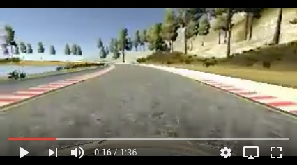

## Behavioral Cloning ##

In this project, I use convolutional neural network to clone cars behavior on a simulation track. Specifically, I trained a model on images to change wheel's angle and car's speed.

---

The goals / steps of this project are the following:
* Use the simulator to collect data of good driving behavior
* Build, a convolution neural network in Keras that predicts steering angles from images
* Train and validate the model with a training and validation set
* Test that the model successfully drives around a track without leaving the road

[//]: # (Image References)

[image1]: ./Images/output_5_1.png "Normal Image"
[image2]: ./Images/output_5_1_flip.png "Flipped Image"
[image3]: ./Images/output_15_0.png "MSE"
[image4]: ./Images/simulator1.jpeg "simulator"
[image5]: ./Images/simulator2.jpeg "simulator"


---
### Files description 

#### 1. In the repo you can find all files required to run the simulator in autonomous mode

My project includes the following files:
* `model.py` containing the script to create and train the model
* `drive.py` for driving the car in autonomous mode
* `model.h5` containing a trained convolution neural network 

#### How to run the simulator
Using the Udacity provided simulator and my `drive.py` file, the car can be driven autonomously around the track by executing 
```sh
python drive.py model.h5
```
The simulator looks like:
![alt text][image4]
![alt text][image5]
You can download it from the [link](https://classroom.udacity.com/nanodegrees/nd013/parts/fbf77062-5703-404e-b60c-95b78b2f3f9e/modules/6df7ae49-c61c-4bb2-a23e-6527e69209ec/lessons/46a70500-493e-4057-a78e-b3075933709d/concepts/1c9f7e68-3d2c-4313-9c8d-5a9ed42583dc)

#### Pipline

The `model.py` file contains the code for training and saving the convolution neural network. The file shows the pipeline I used for training and validating the model, and it contains comments to explain how the code works.

### Brief overview of model Architecture and Training Strategy

#### Architecture

The model architecture is similar to [Nvidia](https://devblogs.nvidia.com/deep-learning-self-driving-cars/) with small corrections. My model consists of a convolution neural network with filter sizes between 3x3 and 5x5; depths between 8 and 20 in Convolution layers and between 1-100 in Dense layers (`model.py lines 91-105`) 

The model includes RELU layers to introduce nonlinearity.
Additionally the data was:
* Normalized in the model using a Keras lambda layer (`code line 94`)
* Cropped (`code line 92`)
* Decrease image depth to 1 instead of 3 (in line 93 with helping functions in `lines 83-87`).

#### Overfitting in the model

The model doesn't contain dropout layers in order to reduce overfitting. Instead of that I checked the model MSE on training and validation set. 

The model was trained and validated on different data sets to ensure that the model was not overfitting (`code line 116-122`). The model was tested by running it through the simulator and ensuring that the vehicle could stay on the track.

![alt text][image3]

#### Model parameters

The model used an adam optimizer, so the learning rate was not tuned manually (`model.py line 105`).

#### Training data

Training data was chosen to keep the vehicle driving on the road. I used a combination of center lane driving, recovering from the left and right sides of the road with steering angles correction 0.3 (`model.py line 27`).

For details about how I created the training data, see the next section. 

### Model Architecture and Training Strategy in detail

#### Design

The overall strategy for deriving a model architecture was to make it simple (number or layers and depth), be able to keep the car on the road and to have low validation loss.

My first step was to use a convolution neural network model similar to the AlexNet. I thought this model might be appropriate because it is common practice to start with simple enough model which has already showed good results in many tasks. But later I realized that [Nvidia](https://devblogs.nvidia.com/deep-learning-self-driving-cars/) model trains faster and takes less size. In addition, I decreased original convolution layers depth because input images are not three dimensions but only one. That's why I have less hyperparameters. As the result, the model trains faster.

In order to gauge how well the model was working, I split my images and steering angle data into a training and validation set. Usually I had less validation loss in the first one-two epochs, but of course later training loss became lower than validation loss. I kept training as well as validation and training losses decreasing. It took me 5 iterations. 

The final step was to run the simulator to see how well the car was driving around track one. There were a few spots where the vehicle fell off the track. To improve the driving behavior in these cases, I made correction (`model.py lines 43-46`). 

At the end of the process, the vehicle is able to drive autonomously around the track without leaving the road.

#### Final Model Architecture

The final model architecture (`model.py lines 91-105`) consisted of five convolution layers followed by three dense layers. The depth of layers:
* Convolutions: 8, 12, 16, 20 and 20
* Dense: 100, 50, 10


#### Training Process

To capture good driving behavior, I first recorded two laps on track one using center lane driving. Here is an example image of center lane driving:

![alt text][image1]

I then recorded the vehicle driving two laps in the opposite direction.

To augment the data sat: flipped images and angles thinking that this would help to have more data without actually collecting it. For example, here is an image that has then been flipped:

![alt text][image2]

After the collection process, I had 15738x2 number of data points (x2 - to count augmented images).

I finally randomly shuffled the data set and put 30% of the data into a validation set. 

I used this training data for training the model. The validation set helped to determine if the model was over or under fitted. The ideal number of epochs was 5 (in more epochs validation loss starts rising). I used an adam optimizer so that manually training the learning rate wasn't necessary.

You can see the final car's modeled behavior on a track:

<video src="SDCSimulation.mp4" width="320" height="200" controls preload></video>

Youtube [](https://youtu.be/v2irPlgY1o0 "Video example - Click to Watch!")

